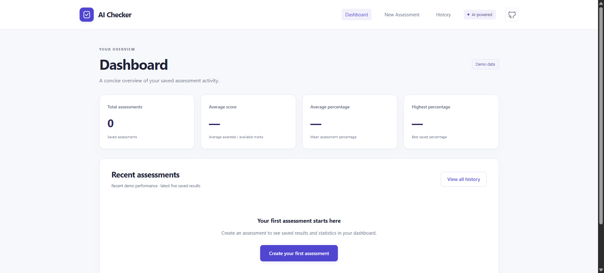
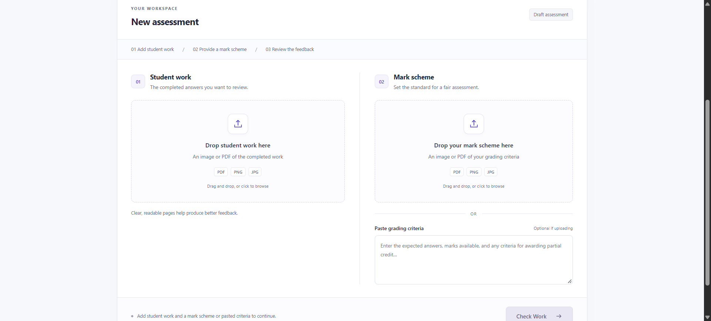
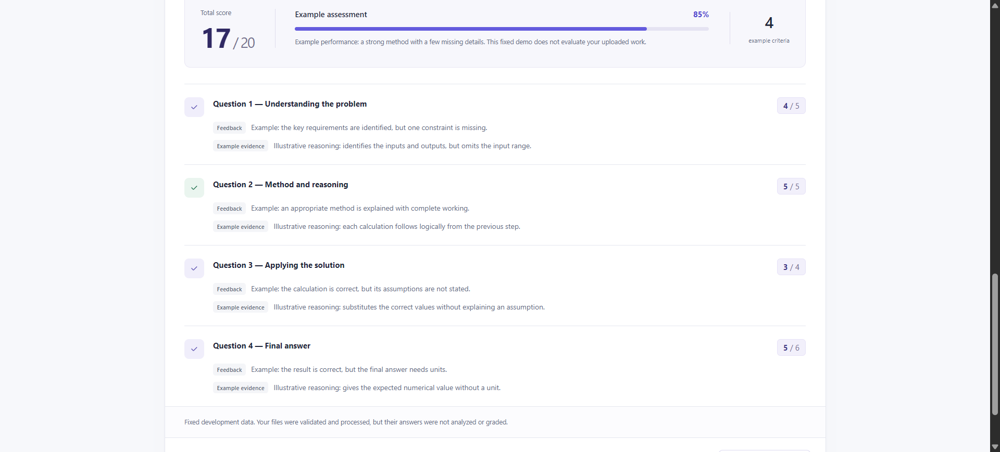
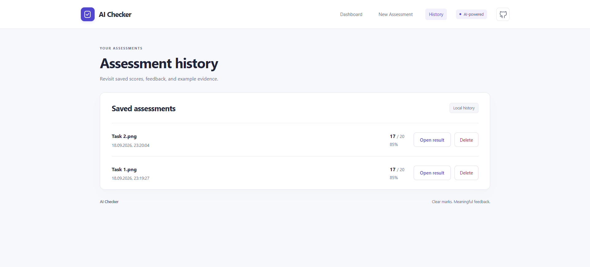

# AI Checker

An AI-assisted assessment platform that evaluates student work against a mark scheme and provides structured feedback.

**Current MVP:** real AI grading is intentionally disabled. Uploaded documents are validated and processed, but results are fixed, clearly labeled demo data. No OpenAI API key or paid API usage is needed.

## Overview

Teachers need to compare student answers with grading criteria and explain why marks were awarded or lost. AI Checker brings uploads, structured feedback, and assessment history into one interface. This Computer Science portfolio project explores that workflow through a small, separated frontend and backend, with a prepared service for future AI grading.

## Features

- Upload student work and mark schemes as PDF, PNG, or JPG/JPEG, or paste manual criteria.
- Validate file types, sizes, PDF readability, and image contents.
- Extract selectable PDF text and flag sparse-text PDFs for future visual processing; no OCR yet.
- Display structured results with decimal marks, calculated percentages, feedback, and evidence.
- Save results in SQLite; browse, open, and delete assessment history.
- View dashboard statistics and recent performance bars in a responsive React interface.
- Use safe mock grading while retaining prepared OpenAI Structured Outputs and multimodal input support.

Uploaded file contents and manual criteria text are not persisted. Only filenames, assessment metadata, and results are saved.

## Screenshots

These screenshots show the portfolio MVP in `GRADING_MODE=mock`. Assessment scores and feedback are fixed demo data, not AI evaluations of uploaded work.

### Dashboard



### New Assessment



### Assessment Results



### History



## Tech Stack

| Layer | Technologies |
| --- | --- |
| Frontend | React, Vite, JavaScript, plain CSS |
| Backend | Python, FastAPI, Pydantic, built-in SQLite, pypdf, Pillow |
| Prepared AI service | Official OpenAI Python SDK, Structured Outputs, multimodal image/PDF inputs |

## Architecture

```text
Browser / React + Vite
          |
          v
    FastAPI REST API
          |
          v
   Document Processing
          |
          v
    Assessment Service
          |
          v
        SQLite
```

The assessment service prepares text or visual inputs and selects a grader by `GRADING_MODE`. Currently, only `mock` is enabled. Setting `openai` returns a configuration error; the separate AI service is not called by any endpoint. History and dashboard endpoints read saved SQLite records directly.

## Project Structure

```text
ai-checker/
├── frontend/
│   ├── src/                   # Interface, uploads, results, dashboard, history
│   ├── .env.example
│   └── package.json
├── backend/
│   ├── main.py                # REST endpoints and startup
│   ├── document_processing.py # PDF extraction and image validation
│   ├── grading.py             # Result models and input preparation
│   ├── assessment_service.py  # Mock grader and mode selection
│   ├── ai_grading.py          # Disconnected OpenAI service
│   ├── database.py            # SQLite persistence
│   ├── test_*.py              # Backend tests
│   ├── .env.example
│   └── requirements.txt
├── docs/screenshots/          # Application screenshots
├── .gitignore
├── LICENSE
└── README.md
```

## Running Locally

Prerequisites: Python 3.10+ (3.12 recommended), Node.js 22.12+ with npm, and two PowerShell terminals. Start both terminals in the project root.

**Terminal 1 - backend:**

```powershell
cd backend
py -3 -m venv .venv
.\.venv\Scripts\python.exe -m pip install -r requirements.txt
Copy-Item .env.example .env
.\.venv\Scripts\python.exe -m uvicorn main:app --reload --port 8000
```

If `py` is unavailable, use `python -m venv .venv` with an installed Python interpreter. No virtual environment activation or PowerShell execution-policy change is needed. Copy environment examples only on first setup; keep any existing local configuration.

**Terminal 2 - frontend:**

```powershell
cd frontend
npm install
Copy-Item .env.example .env
npm run dev -- --port 5173 --strictPort
```

Open [AI Checker](http://localhost:5173). Check [backend health](http://localhost:8000/health) or explore [API docs](http://localhost:8000/docs). The database is created automatically at `backend/data/ai_checker.db` and is excluded from Git. Development CORS allows localhost and 127.0.0.1 on port 5173.

## Environment Variables

Backend `.env`:

```dotenv
GRADING_MODE=mock
OPENAI_API_KEY=
OPENAI_MODEL=gpt-4.1-mini
```

Mock mode needs no OpenAI credentials. The model setting is reserved for future grading; adding a key does not enable real grading. Environment variables override `.env` values.

Frontend `.env`:

```dotenv
VITE_API_URL=http://localhost:8000
```

Restart Vite after changing this value. `VITE_*` values are exposed to the browser, so never put an API key there. Real `.env` files are ignored; `.env.example` files are safe to commit.

## Testing

From the project root, run backend tests:

```powershell
cd backend
.\.venv\Scripts\python.exe -m unittest discover -v
```

Tests use temporary databases and mocked OpenAI transports; no real API requests or credentials are needed.

In a separate terminal from the project root, build the frontend:

```powershell
cd frontend
npm run build
```

For a manual check, submit sample work with criteria, view the demo result, find it in History, and verify Dashboard updates after saving or deleting it.

## Current Status

This is a portfolio MVP with mock grading enabled. The OpenAI infrastructure is prepared but intentionally disabled. Upload limits are 10 MB per file, 50 PDF pages, and 20 megapixels per image. Scanned PDFs are flagged rather than OCR-processed. With no authentication, all assessments share one local history; the app is intended for local development.

## Future Improvements

- Enable real AI grading with controlled API usage and quality checks.
- Add authentication and separate user histories.
- Deploy the frontend and backend.
- Add optional scalability improvements as usage grows.

Licensed under the [MIT License](LICENSE).
